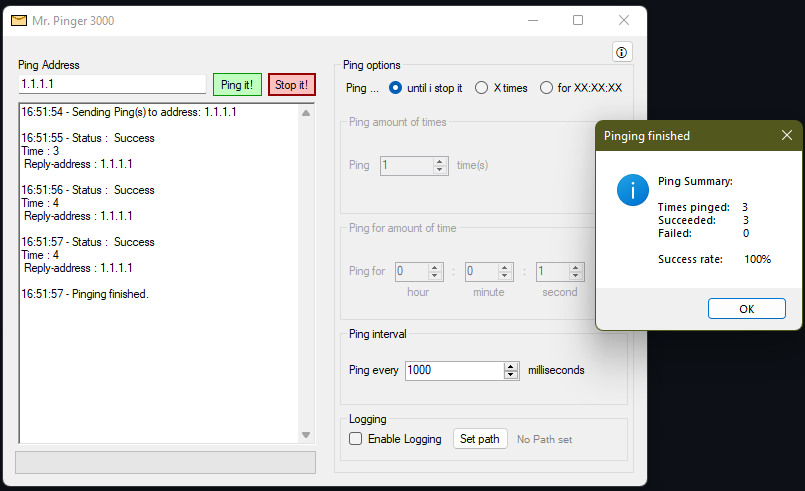

# Mr. Pinger 3000
### A Tool for figuring out what the heck is wrong with your network.
This Tool features:
* Pinging ip adresses and domains
* setting a timer for pinging
* setting amount of times something should get pinged
* setting timeout time between pings
* logging all ping into a file inclusive summary at the end
* summary at the end of pinging that shows success rate of pings etc.
* can be run in multiple instances

## Installation
You can either download the installer, the portable version or modify and compile the pinger tool yourself. All you need is right here in this repository :)
